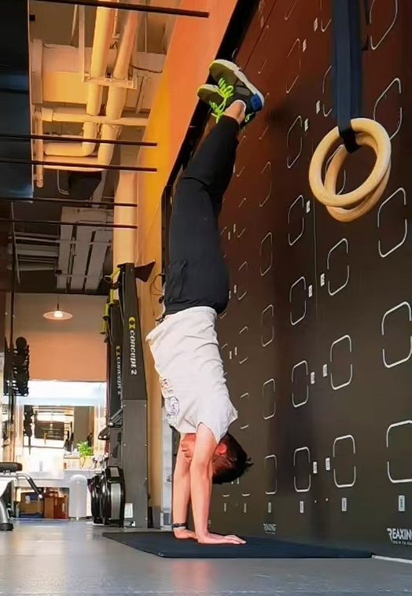
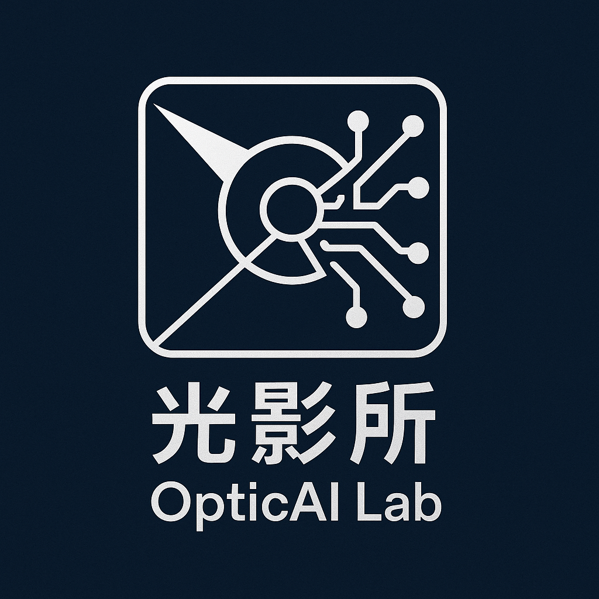

## Xiaoyun Yuan (袁肖赟), Ph.D.

<!--  -->

 
Tenure-track Associate Professor  
[Artificial Intelligence Institute](https://ai.sjtu.edu.cn/) 
School of Computer Science 
Shanghai Jiao Tong University (SJTU)  
yuanxiaoyun AT sjtu.edu.cn 

 
**Short Bio:**
Xiaoyun Yuan is an Associate Professor at the Artificial Intelligence Institute, School of Computer Science, Shanghai Jiao Tong University. He was previously a postdoctoral researcher in the [Sigma lab](https://www.luvision.net/), Department of Electronic Engineering, Tsinghua University. He received his B.S. from the University of Science and Technology of China in 2014 and his Ph.D. from the Hong Kong University of Science and Technology in 2020. Dr. Yuan has published approximately 20 academic papers in leading journals and conferences, including Nature Biomedical Engineering, Nature Communications, Light: Science & Applications, IEEE TPAMI, and CVPR. His research interests lie in computer vision, computational imaging, photoacoustic tomography, and optical computing. Notably, his work on human brain functional photoacoustic tomography earned the Best Paper Award at SPIE Photonics West 2021.

---

## Research Interests
My research focuses on computational imaging and visual intelligence, with a strong emphasis on hardware-software co-design and opto-electronic co-optimization. Key areas of my work include computational imaging with camera arrays, photoacoustic tomography for brain imaging, and optical computing. Currently, I am exploring the intersection of AI + optics, computational imaging + large vision models, and computational imaging + embodied AI. For more details, please visit my [Reseach Page](/research/).
We also run an official WeChat public account (OpticAI lab 光影所) where we regularly share updates on our team's work and discuss cutting-edge research ideas. Welcome to follow us! 

 

**We are actively looking for self-driven students!**

**诚挚欢迎充满激情和自我驱动力的学生加入我们的团队！如果你对计算成像、视觉智能、AI+光学等前沿领域充满兴趣，并渴望在创新研究中挑战自我、拓展边界，这里就是你的舞台！加入我们，把你的简历砸过来, 一起探索未知、创造未来！**

[**想加入我们, Join us, Click here!!!**](/research/intern_Chinese/)

<!-- - [Computational imaging with camera arrays](/research/gigapixel/)
- [Photoacoustic tomography for human brain](/research/PACT/)
- [Optical computing](/research/optical_computing/) -->

---

## News and Updates
- **Jun 26, 2024**：One paper accepted by ICCV 2025. DMDiff: Degradation-Modeled Multipath Diffusion for Tunable Metalens Photography. Visit our [**project page**](https://dmdiff.github.io/) for more details, code and data will be released soon. Congratulations to Jiayi Zhu and Feiyu Ji.
- **Dec 7, 2024**：We publish GBR (Generative Bundle Refinement), a method for high-fidelity Gaussian splatting and meshing using only 4–6 input views. Visit our [**project page**](https://gbrnvs.github.io/) and [**paper**](https://arxiv.org/abs/2412.05908) for more details.
- **Nov 11, 2024**：I joined [Artificial Intelligence Institute, Shanghai Jiao Tong Univeristy](https://ai.sjtu.edu.cn/) as an associate professor.
- **Mar 9, 2024**：Paper "[SPECAT: SPatial-spEctral Cumulative-Attention Transformer for High-Resolution Hyperspectral Image Reconstruction](https://openaccess.thecvf.com/content/CVPR2024/html/Yao_SPECAT_SPatial-spEctral_Cumulative-Attention_Transformer_for_High-Resolution_Hyperspectral_Image_Reconstruction_CVPR_2024_paper.html)" accepted by **CVPR 2024**.
- **Jan 24, 2024**：Paper "[Photonic neuromorphic architecture for tens-of-task lifelong learning](https://www.nature.com/articles/s41377-024-01395-4)" accepted by **Light: Science & Applications**.
- **Oct 25, 2023**：Paper "[Training large-scale optoelectronic neural networks with dual-neuron optical-artificial learning](https://www.nature.com/articles/s41467-023-42984-y)" accepted by **Nature Communications**.
 

---

<!-- <blockquote class="twitter-tweet">
Thrilled to be an AAAI-UC Scholar at <a href="https://twitter.com/hashtag/AAAI24?src=hash&amp;ref_src=twsrc%5Etfw">#AAAI24</a>, thanks to <a href="https://twitter.com/hashtag/AAAI?src=hash&amp;ref_src=twsrc%5Etfw">#AAAI</a> &amp; <a href="https://twitter.com/hashtag/GoogleExploreCSR?src=hash&amp;ref_src=twsrc%5Etfw">#GoogleExploreCSR</a> for the sponsorship. Grateful for the knowledge gained and new friendships formed.  Wonderful trip in Vancouver. Looking forward to staying connected with all.<a href="https://twitter.com/hashtag/AAAI24?src=hash&amp;ref_src=twsrc%5Etfw">#AAAI24</a> <a href="https://twitter.com/hashtag/Vancouver?src=hash&amp;ref_src=twsrc%5Etfw">#Vancouver</a> <a href="https://twitter.com/hashtag/GoogleExploreCSR?src=hash&amp;ref_src=twsrc%5Etfw">#GoogleExploreCSR</a> <a href="https://t.co/wUQUp8XlSM">pic.twitter.com/wUQUp8XlSM</a>
&mdash; Hanlin CAI (seeking a PhD position 2025) (@lancecai2002) <a href="https://twitter.com/lancecai2002/status/1762210025173344260?ref_src=twsrc%5Etfw">February 26, 2024</a></blockquote>  -->

