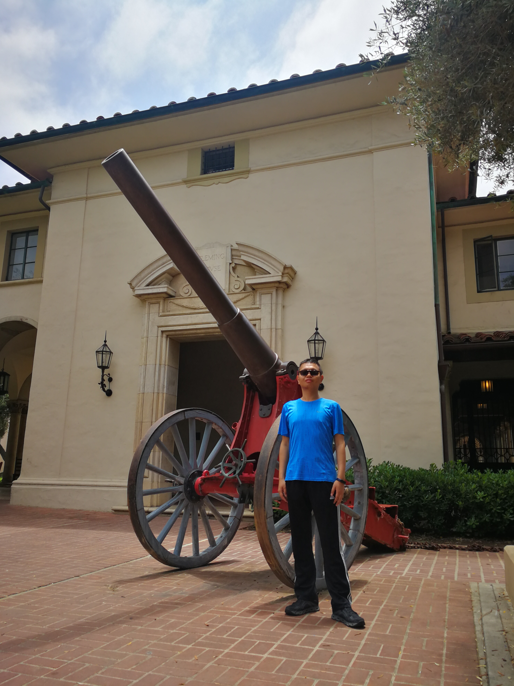
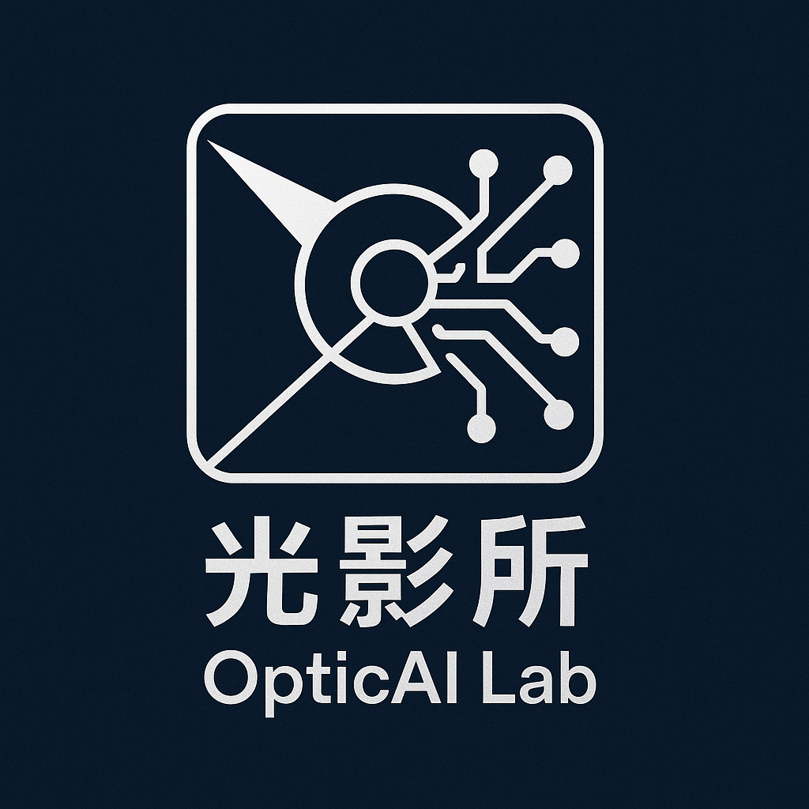

<!-- 引入你的公共样式 -->
<link rel="stylesheet" href="/assets/css/custom.css">

  <!-- 顶部两列：个人信息 + Short Bio -->
  

    <!-- 个人信息卡片 -->
    

      

        
      

      
      

        <h1 class="about-name">Xiaoyun Yuan (袁肖赟), Ph.D.</h1>
        
Associate Professor

        
        

          <a href="https://ai.sjtu.edu.cn/">Artificial Intelligence Institute</a> 
          School of Computer Science 
          Shanghai Jiao Tong University 
          Email: <code>yuanxiaoyun AT sjtu.edu.cn</code>
        

        
        

          <a href="mailto:yuanxiaoyun@sjtu.edu.cn" class="pub-link-btn">Email</a>
          <a href="https://github.com/yuanxy92" target="_blank" class="pub-link-btn">GitHub</a>
          <a href="https://scholar.google.com/citations?user=YOUR_SCHOLAR_ID" target="_blank" class="pub-link-btn">Google Scholar</a>
          <a href="https://xiaoyunyuan.net" target="_blank" class="pub-link-btn">Lab page</a>
        

      

    

    <!-- Short Bio 卡片 -->
    

      <h2 class="unified-heading-block" style="margin-top: 0;">Short Bio</h2>
      
      
Xiaoyun Yuan is an Associate Professor at the Artificial Intelligence Institute, School of Computer Science, Shanghai Jiao Tong University. He was previously a postdoctoral researcher in the <a href="https://www.luvision.net/" target="_blank">Sigma lab</a>, Department of Electronic Engineering, Tsinghua University.He received his B.S. from the University of Science and Technology of China in 2014 and his Ph.D. from the Hong Kong University of Science and Technology in 2020. Dr. Yuan has published approximately 20 academic papers in leading journals and conferences, including <em>Nature Biomedical Engineering</em>, <em>Nature Communications</em>, <em>Light: Science & Applications</em>, IEEE TPAMI, and CVPR. His research interests lie in computer vision, computational imaging, photoacoustic tomography, and optical computing. Notably, his work on human brain functional photoacoustic tomography earned the Best Paper Award at SPIE Photonics West 2021.

      
      

        <a href="/interns/">👉 长期招收本科实习生！欢迎对计算成像、AI+光学感兴趣的同学联系我</a>
      

    

  

    <!-- 最新动态（全屏宽度，所有链接统一为btn样式） -->
    

    <h2 class="unified-heading-block">News & Updates</h2>
    
    

        

        May 1, 2026
        New
        One paper has been accepted in principle by <strong>Nature Communications 2026</strong>. Details will be announced after the official acceptance notification is received.
        

        
        

        Mar. 31, 2026
        New
        Our paper <strong>"LUCID: Learning Unified Control for Image Deflaring and Exposure Mastery in Nighttime Photography"</strong> has been accepted by <strong>SIGGRAPH 2026</strong>. Congratulations to first author Tingyu Yang (杨庭语，SJTU 大三).
        <a href="https://xiaoyunyuan.net/index.html?project=lucid" class="news-btn">Project Page</a>
        

        
        

        Feb. 21, 2026
        New
        Our paper <strong>"3M-TI: High-Quality Mobile Thermal Imaging via Calibration-free Multi-Camera Cross-Modal Diffusion"</strong> has been accepted by <strong>CVPR 2026</strong>. Special congratulations to undergraduate Junzhe Wan (万骏哲, SJTU 大四) and Ph.D. candidate Minchong Chen.
        <a href="https://xiaoyunyuan.net/index.html?project=3m-ti" class="news-btn">Code & Data</a>
        

        
        

        Sep. 4, 2025
        Our paper <strong>"Integrated lithium niobate photonics for sub-angstrom snapshot spectroscopy"</strong> has been accepted by <strong>Nature 2025</strong>. 
        <a href="https://www.nature.com/articles/s41586-025-09591-x" class="news-btn">Paper</a>
        

        
        

        Jul. 31, 2025
        Our paper <strong>"GBR: Generative Bundle Refinement for High-fidelity Gaussian Splatting with Enhanced Mesh Reconstruction"</strong> has been accepted by <strong>IEEE Trans. on CSVT 2025</strong>.
        <a href="https://gbrnvs.github.io/" class="news-btn">Project Page</a>
        

        
        

        Jun. 26, 2025
        Our paper <strong>"DMDiff: Degradation-Modeled Multipath Diffusion for Tunable Metalens Photography"</strong> has been accepted by <strong>ICCV 2025</strong>. Special congratulations to undergraduate Jiayi Zhu (朱嘉熠, SJTU 大三) and Ph.D. candidate Feiyu Ji.
        <a href="https://dmdiff.github.io/" class="news-btn">Project Page</a>
        

        
        

        Nov. 11, 2024
        I joined the Artificial Intelligence Institute, Shanghai Jiao Tong University as an associate professor.
        <a href="https://ai.sjtu.edu.cn/" class="news-btn">Visit Institute</a>
        

        
        

        Mar. 9, 2024
        Our paper <strong>"SPECAT: SPatial-spEctral Cumulative-Attention Transformer for High-Resolution Hyperspectral Image Reconstruction"</strong> has been accepted by <strong>CVPR 2024</strong>.
        <a href="https://openaccess.thecvf.com/content/CVPR2024/html/Yao_SPECAT_SPatial-spEctral_Cumulative-Attention_Transformer_for_High-Resolution_Hyperspectral_Image_Reconstruction_CVPR_2024_paper.html" class="news-btn">Paper</a>
        

        
        

        Jan. 24, 2024
        Our paper <strong>"Photonic neuromorphic architecture for tens-of-task lifelong learning"</strong> has been accepted by <strong>Light: Science & Applications</strong>.
        <a href="https://www.nature.com/articles/s41377-024-01395-4" class="news-btn">Paper</a>
        

        
        

        Oct. 25, 2023
        Our paper <strong>"Training large-scale optoelectronic neural networks with dual-neuron optical-artificial learning"</strong> has been accepted by <strong>Nature Communications</strong>.
        <a href="https://www.nature.com/articles/s41467-023-42984-y" class="news-btn">Paper</a>
        

    

    

  <!-- 社交媒体二维码（全屏宽度） -->
  

    <h2 class="unified-heading-block">Follow Us</h2>
    
    

      

        We run an official WeChat public account and Xiaohongshu account where we regularly share updates on our team's work and discuss cutting-edge research ideas. Welcome to follow us!
      

      
      

        

          
          
微信公众号：OpticAI lab 光影所

        

        
        

          
          
光影所Logo

        

        
        

          
          
小红书：Hunter

        

      

    

  

  <!-- 访问统计（新增卡片样式） -->
  

    <h2 class="unified-heading-block">Visitors</h2>
    
    

      
    

  

